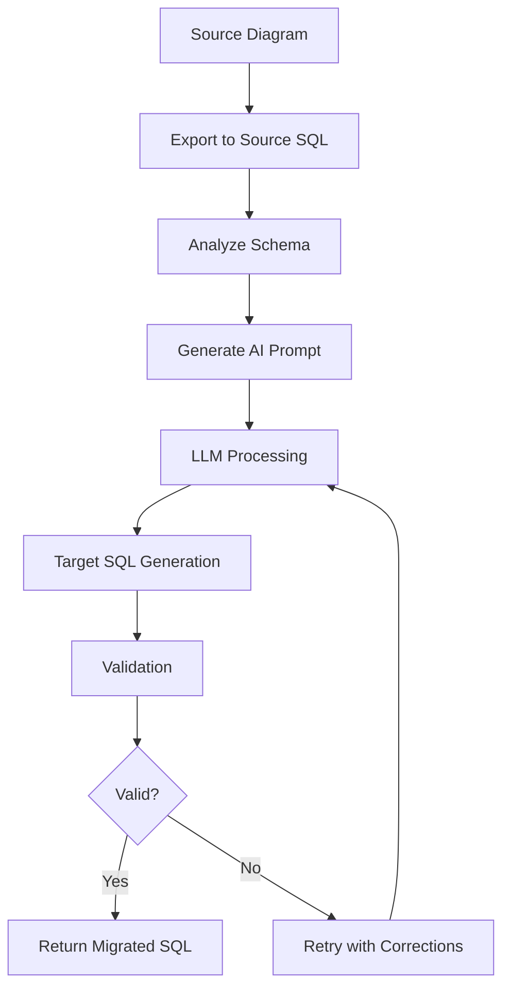

ChartDB's AI-powered migration feature uses large language models to intelligently convert database schemas between different SQL dialects, handling complex type conversions and dialect-specific features that traditional converters struggle with.

## Overview

AI migration leverages OpenAI's language models to provide context-aware database schema translation, going beyond simple type mapping to understand the semantic meaning of your schema and generate optimized DDL for the target database.

<Info>
AI migration is available as an enhanced alternative to ChartDB's built-in deterministic cross-dialect conversion. Use it when migrating between databases that don't have deterministic conversion support, or when you need more sophisticated transformations.
</Info>

## When to Use AI Migration

<CardGroup cols={2}>
  <Card title="Complex Schemas" icon="diagram-project">
    Schemas with database-specific features and optimizations
  </Card>
  <Card title="Unsupported Paths" icon="route">
    Migration paths not covered by deterministic conversion
  </Card>
  <Card title="Custom Types" icon="code">
    Complex custom types, domains, and user-defined types
  </Card>
  <Card title="Optimization" icon="gauge-high">
    Generating database-specific performance optimizations
  </Card>
</CardGroup>

## Configuration

### API Setup

AI migration requires OpenAI API configuration:

```typescript
// Environment variables
const OPENAI_API_KEY = process.env.OPENAI_API_KEY;
const OPENAI_API_ENDPOINT = process.env.OPENAI_API_ENDPOINT || 'https://api.openai.com/v1';
const LLM_MODEL_NAME = process.env.LLM_MODEL_NAME || 'gpt-4';
```

### Model Selection

ChartDB supports various OpenAI models:

| Model | Best For | Cost |
|-------|----------|------|
| `gpt-4` | Complex migrations, high accuracy | Higher |
| `gpt-4-turbo` | Fast migrations, good accuracy | Medium |
| `gpt-3.5-turbo` | Simple migrations, budget-friendly | Lower |

<Tip>
For production migrations, use `gpt-4` for the most accurate and reliable results. For development and testing, `gpt-3.5-turbo` is often sufficient.
</Tip>

## How It Works

The AI migration process follows these steps:



<Steps>
  <Step title="Schema Analysis">
    The source schema is analyzed to identify:
    - Database-specific features
    - Custom types and constraints
    - Index strategies
    - Performance optimizations
  </Step>
  
  <Step title="Context Building">
    A detailed prompt is constructed with:
    - Source database type and version
    - Target database type and version
    - Schema complexity indicators
    - Special requirements
  </Step>
  
  <Step title="LLM Translation">
    The language model processes the schema and generates:
    - Type-converted table definitions
    - Target-appropriate constraints
    - Optimized indexes
    - Migration notes and warnings
  </Step>
  
  <Step title="Validation">
    Generated SQL is validated for:
    - Syntax correctness
    - Referential integrity
    - Feature compatibility
  </Step>
</Steps>

## AI Migration Examples

### PostgreSQL to MySQL

<CodeGroup>

```sql PostgreSQL Source
-- PostgreSQL with array types and JSONB
CREATE TABLE users (
    id SERIAL PRIMARY KEY,
    email VARCHAR(255) NOT NULL UNIQUE,
    tags TEXT[],
    settings JSONB,
    created_at TIMESTAMP DEFAULT CURRENT_TIMESTAMP
);

-- GIN index for array search
CREATE INDEX idx_users_tags ON users USING GIN(tags);

-- PostgreSQL-specific regex check
ALTER TABLE users 
ADD CONSTRAINT check_email 
CHECK (email ~* '^[A-Za-z0-9._%+-]+@[A-Za-z0-9.-]+\.[A-Z|a-z]{2,}$');
```

```sql AI-Generated MySQL
-- MySQL conversion with AI optimization
CREATE TABLE `users` (
  `id` INT AUTO_INCREMENT PRIMARY KEY,
  `email` VARCHAR(255) NOT NULL UNIQUE,
  `tags` JSON COMMENT 'Converted from PostgreSQL TEXT array',
  `settings` JSON COMMENT 'Converted from PostgreSQL JSONB',
  `created_at` TIMESTAMP DEFAULT CURRENT_TIMESTAMP,
  INDEX `idx_users_tags` ((CAST(`tags` AS CHAR(255) ARRAY))) 
    COMMENT 'Functional index on JSON array',
  CONSTRAINT `check_email` 
    CHECK (`email` REGEXP '^[A-Za-z0-9._%+-]+@[A-Za-z0-9.-]+\.[A-Z|a-z]{2,}$')
) ENGINE=InnoDB DEFAULT CHARSET=utf8mb4 COLLATE=utf8mb4_unicode_ci;

-- Migration Notes:
-- 1. PostgreSQL arrays converted to JSON for compatibility
-- 2. GIN index converted to functional index on JSON
-- 3. Regex pattern adapted to MySQL REGEXP syntax
-- 4. Added InnoDB engine and UTF8MB4 charset for best practices
```

</CodeGroup>

### Oracle to PostgreSQL

<CodeGroup>

```sql Oracle Source
-- Oracle with sequences and specific types
CREATE SEQUENCE emp_seq START WITH 1000 INCREMENT BY 1;

CREATE TABLE employees (
    employee_id NUMBER PRIMARY KEY,
    email VARCHAR2(255) NOT NULL,
    hire_date DATE DEFAULT SYSDATE,
    salary NUMBER(10,2) CHECK (salary > 0),
    department_id NUMBER,
    CONSTRAINT fk_dept 
        FOREIGN KEY (department_id) 
        REFERENCES departments(department_id)
);

CREATE INDEX idx_emp_email ON employees(email);
```

```sql AI-Generated PostgreSQL
-- PostgreSQL conversion with modern features
CREATE TABLE employees (
    employee_id SERIAL PRIMARY KEY,
    email VARCHAR(255) NOT NULL,
    hire_date DATE DEFAULT CURRENT_DATE,
    salary NUMERIC(10,2) CHECK (salary > 0),
    department_id INT,
    CONSTRAINT fk_dept 
        FOREIGN KEY (department_id) 
        REFERENCES departments(department_id)
        ON DELETE SET NULL
);

-- Optimized B-tree index
CREATE INDEX idx_emp_email ON employees(email);

-- Optional: Sequence for employee_id if needed
-- CREATE SEQUENCE emp_seq START WITH 1000 INCREMENT BY 1;
-- ALTER TABLE employees ALTER COLUMN employee_id 
--   SET DEFAULT nextval('emp_seq');

-- Migration Notes:
-- 1. Oracle NUMBER converted to SERIAL/NUMERIC based on usage
-- 2. SYSDATE converted to CURRENT_DATE
-- 3. VARCHAR2 converted to VARCHAR
-- 4. Added ON DELETE SET NULL for better referential integrity
```

</CodeGroup>

### SQL Server to PostgreSQL

<CodeGroup>

```sql SQL Server Source
-- SQL Server with T-SQL specific features
CREATE TABLE [dbo].[Users] (
    [Id] INT IDENTITY(1,1) PRIMARY KEY,
    [Email] NVARCHAR(255) NOT NULL,
    [UniqueId] UNIQUEIDENTIFIER DEFAULT NEWID(),
    [CreatedAt] DATETIME2 DEFAULT GETDATE(),
    [Data] NVARCHAR(MAX),
    CONSTRAINT [UQ_Email] UNIQUE ([Email])
);

CREATE NONCLUSTERED INDEX [IX_Users_Email]
ON [dbo].[Users] ([Email])
INCLUDE ([UniqueId], [CreatedAt]);
```

```sql AI-Generated PostgreSQL
-- PostgreSQL conversion with UUID extension
CREATE EXTENSION IF NOT EXISTS "uuid-ossp";

CREATE TABLE public.users (
    id SERIAL PRIMARY KEY,
    email VARCHAR(255) NOT NULL,
    unique_id UUID DEFAULT uuid_generate_v4(),
    created_at TIMESTAMP DEFAULT NOW(),
    data TEXT,
    CONSTRAINT uq_email UNIQUE (email)
);

-- B-tree index with included columns via INCLUDE clause (PG11+)
CREATE INDEX ix_users_email 
ON public.users(email) 
INCLUDE (unique_id, created_at);

-- Migration Notes:
-- 1. IDENTITY converted to SERIAL
-- 2. NVARCHAR converted to VARCHAR (PostgreSQL uses UTF-8 by default)
-- 3. UNIQUEIDENTIFIER converted to UUID with uuid-ossp extension
-- 4. DATETIME2 converted to TIMESTAMP
-- 5. NVARCHAR(MAX) converted to TEXT
-- 6. Index with INCLUDE clause requires PostgreSQL 11+
```

</CodeGroup>

## Advanced AI Capabilities

### Semantic Understanding

The AI understands the purpose of your schema:

<Tabs>
  <Tab title="Naming Conventions">
    ```sql
    -- AI recognizes this is a timestamp field
    -- and suggests appropriate defaults
    
    Source: created_date DATE
    Target: created_at TIMESTAMP DEFAULT CURRENT_TIMESTAMP
    ```
  </Tab>

  <Tab title="Relationship Patterns">
    ```sql
    -- AI infers proper cascade behavior
    
    Source: Basic FK without cascade
    Target: FK with ON DELETE CASCADE 
            (for child records)
    Target: FK with ON DELETE SET NULL 
            (for optional references)
    ```
  </Tab>

  <Tab title="Performance Hints">
    ```sql
    -- AI adds appropriate indexes
    
    Source: Large text field
    Target: + Full-text search index
    
    Source: Foreign key column
    Target: + Index for FK lookups
    ```
  </Tab>

  <Tab title="Data Type Optimization">
    ```sql
    -- AI chooses optimal types
    
    Source: NVARCHAR(MAX)
    Target: TEXT (if storing large content)
    Target: VARCHAR(n) (if predictable size)
    ```
  </Tab>
</Tabs>

### Feature Translation

Complex database features are intelligently translated:

<AccordionGroup>
  <Accordion title="Partitioning">
    ```sql
    -- PostgreSQL range partitioning
    CREATE TABLE measurements (
        id SERIAL,
        measured_at TIMESTAMP,
        value NUMERIC
    ) PARTITION BY RANGE (measured_at);
    
    -- AI converts to MySQL partitioning syntax
    CREATE TABLE measurements (
        id INT AUTO_INCREMENT,
        measured_at TIMESTAMP,
        value DECIMAL(10,2),
        PRIMARY KEY (id, measured_at)
    ) PARTITION BY RANGE (YEAR(measured_at)) (
        PARTITION p2023 VALUES LESS THAN (2024),
        PARTITION p2024 VALUES LESS THAN (2025)
    );
    ```
  </Accordion>

  <Accordion title="Generated Columns">
    ```sql
    -- PostgreSQL generated column
    CREATE TABLE products (
        price NUMERIC,
        tax_rate NUMERIC,
        total NUMERIC GENERATED ALWAYS AS (price * (1 + tax_rate)) STORED
    );
    
    -- AI converts to MySQL generated column
    CREATE TABLE products (
        price DECIMAL(10,2),
        tax_rate DECIMAL(4,3),
        total DECIMAL(10,2) AS (price * (1 + tax_rate)) STORED
    );
    ```
  </Accordion>

  <Accordion title="Window Functions in Views">
    ```sql
    -- Complex view with window functions
    -- AI ensures syntax compatibility across databases
    CREATE VIEW ranked_products AS
    SELECT 
        product_id,
        name,
        price,
        ROW_NUMBER() OVER (PARTITION BY category ORDER BY price DESC) as rank
    FROM products;
    ```
  </Accordion>

  <Accordion title="Triggers">
    ```sql
    -- PostgreSQL trigger
    CREATE OR REPLACE FUNCTION update_modified_column()
    RETURNS TRIGGER AS $$
    BEGIN
        NEW.modified_at = NOW();
        RETURN NEW;
    END;
    $$ LANGUAGE plpgsql;
    
    -- AI converts to MySQL trigger
    DELIMITER $$
    CREATE TRIGGER update_modified_column
    BEFORE UPDATE ON table_name
    FOR EACH ROW
    BEGIN
        SET NEW.modified_at = NOW();
    END$$
    DELIMITER ;
    ```
  </Accordion>
</AccordionGroup>

## Prompt Engineering

ChartDB uses carefully crafted prompts for optimal results:

```typescript
const generateMigrationPrompt = (
    sourceSQL: string,
    sourceDB: DatabaseType,
    targetDB: DatabaseType
): string => {
    return `
You are a database migration expert. Convert this ${sourceDB} schema to ${targetDB}.

Requirements:
1. Preserve all data integrity constraints
2. Use native ${targetDB} features where appropriate
3. Optimize for ${targetDB} performance best practices
4. Include migration notes for any non-trivial conversions
5. Add comments explaining type conversions
6. Ensure referential integrity is maintained

Source SQL (${sourceDB}):
${sourceSQL}

Generate optimized ${targetDB} DDL with:
- Type conversions explained
- Index strategy for ${targetDB}
- Any ${targetDB}-specific optimizations
- Migration warnings if applicable

Return only valid ${targetDB} SQL DDL.
`;
};
```

## Response Processing

The AI response is processed and validated:

```typescript
interface AIMigrationResult {
    sql: string;
    warnings: string[];
    notes: string[];
    confidence: number;
}

const processAIResponse = async (
    response: string,
    targetDB: DatabaseType
): Promise<AIMigrationResult> => {
    // Extract SQL from response
    const sql = extractSQL(response);
    
    // Extract migration notes
    const notes = extractNotes(response);
    
    // Validate syntax
    const isValid = await validateSQL(sql, targetDB);
    
    // Extract warnings
    const warnings = extractWarnings(response);
    
    return {
        sql,
        warnings,
        notes,
        confidence: calculateConfidence(response),
    };
};
```

## Cost Estimation

Estimate migration cost before running:

```typescript
interface MigrationCost {
    estimatedTokens: number;
    estimatedCost: number;
    currency: string;
}

const estimateMigrationCost = (
    sourceSQL: string,
    model: string
): MigrationCost => {
    // Rough token estimation (4 chars ≈ 1 token)
    const inputTokens = Math.ceil(sourceSQL.length / 4);
    const estimatedOutputTokens = inputTokens * 1.5; // Response usually 1.5x input
    const totalTokens = inputTokens + estimatedOutputTokens;
    
    // Model pricing (per 1K tokens)
    const pricing = {
        'gpt-4': { input: 0.03, output: 0.06 },
        'gpt-4-turbo': { input: 0.01, output: 0.03 },
        'gpt-3.5-turbo': { input: 0.0005, output: 0.0015 },
    };
    
    const rate = pricing[model] || pricing['gpt-4'];
    const cost = 
        (inputTokens / 1000 * rate.input) +
        (estimatedOutputTokens / 1000 * rate.output);
    
    return {
        estimatedTokens: totalTokens,
        estimatedCost: cost,
        currency: 'USD',
    };
};
```

## Error Handling

Robust error handling for AI migrations:

<Warning>
AI migration can fail due to API limits, token limits, or invalid responses. ChartDB implements automatic retry with exponential backoff and falls back to deterministic conversion when available.
</Warning>

```typescript
const migrateWithRetry = async (
    sourceSQL: string,
    targetDB: DatabaseType,
    maxRetries: number = 3
): Promise<string> => {
    for (let attempt = 1; attempt <= maxRetries; attempt++) {
        try {
            const result = await callOpenAI(sourceSQL, targetDB);
            return result.sql;
        } catch (error) {
            if (attempt === maxRetries) {
                // Fall back to deterministic conversion if available
                if (hasCrossDialectSupport(sourceDB, targetDB)) {
                    return deterministicConversion(sourceSQL, targetDB);
                }
                throw new Error('AI migration failed after all retries');
            }
            
            // Exponential backoff
            await sleep(Math.pow(2, attempt) * 1000);
        }
    }
};
```

## Best Practices

<Tip>
For successful AI migrations:

1. **Review Output**: Always review AI-generated SQL before deployment
2. **Test Thoroughly**: Test migrations on staging data first
3. **Compare Results**: Compare with deterministic conversion when available
4. **Document Changes**: Keep AI migration notes for reference
5. **Validate Constraints**: Ensure all constraints are properly converted
6. **Check Performance**: Review generated indexes and optimizations
7. **Monitor Costs**: Track API usage for budget planning
</Tip>

## Limitations

<AccordionGroup>
  <Accordion title="Token Limits">
    Very large schemas may exceed model token limits. Split into smaller batches if needed.
  </Accordion>
  
  <Accordion title="Non-Deterministic">
    AI responses may vary between runs. Use deterministic conversion for production when available.
  </Accordion>
  
  <Accordion title="Complex Features">
    Extremely database-specific features may require manual review and adjustment.
  </Accordion>
  
  <Accordion title="Cost Considerations">
    Large schemas can incur significant API costs. Estimate before running.
  </Accordion>
</AccordionGroup>

## Comparison: AI vs Deterministic

| Aspect | AI Migration | Deterministic Conversion |
|--------|-------------|-------------------------|
| **Accuracy** | High, context-aware | Very high, tested |
| **Speed** | API-dependent (seconds) | Instant |
| **Cost** | Per-use API cost | Free |
| **Consistency** | May vary | Always same result |
| **Optimization** | Database-specific suggestions | Standard mapping |
| **Complex Features** | Better handling | Limited support |
| **Unsupported Paths** | Works for all combinations | Limited paths |

<Info>
Use **deterministic conversion** when available for production migrations. Use **AI migration** for unsupported paths or when you need additional optimization suggestions.
</Info>

## Security Considerations

<Warning>
Your schema is sent to OpenAI's API. Do not include sensitive data, credentials, or proprietary information in table names, column names, or comments during AI migration.
</Warning>

Security best practices:
- Sanitize schema before migration
- Use environment variables for API keys
- Review OpenAI's data usage policies
- Consider self-hosted LLM alternatives for sensitive schemas

## Next Steps

<CardGroup cols={2}>
  <Card title="Export Options" icon="file-export" href="/features/export-options">
    Learn about all export formats
  </Card>
  <Card title="Import Methods" icon="file-import" href="/features/import-methods">
    Explore different import options
  </Card>
</CardGroup>
