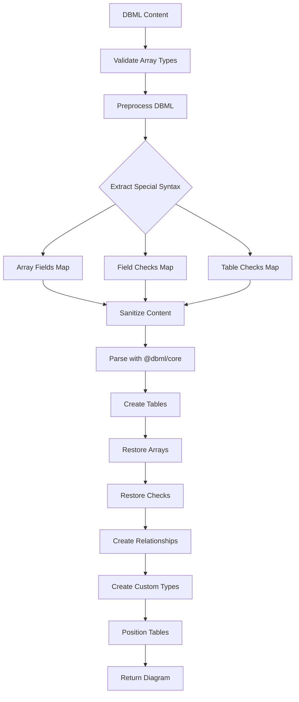

DBML (Database Markup Language) is a simple, readable DSL designed to define database structures. ChartDB provides comprehensive DBML import with support for tables, relationships, enums, indexes, and constraints.

## What is DBML?

DBML is a declarative language for defining database schemas. It's human-readable, version-control friendly, and supports all major relational database features.

### Why Use DBML?

<CardGroup cols={2}>
  <Card title="Human Readable" icon="eye">
    Clean syntax that's easy to read and write
  </Card>
  <Card title="Version Control" icon="git-alt">
    Perfect for tracking schema changes in Git
  </Card>
  <Card title="Database Agnostic" icon="database">
    Works with any relational database
  </Card>
  <Card title="Quick Prototyping" icon="bolt">
    Rapidly design schemas without SQL syntax
  </Card>
</CardGroup>

## Basic DBML Syntax

### Table Definition

```dbml
Table users {
  id int [pk, increment]
  email varchar(255) [unique, not null]
  name varchar(100)
  role varchar(20) [default: 'user']
  created_at timestamp [default: `now()`]
  
  Note: 'User accounts table'
}
```

### Field Attributes

ChartDB supports all standard DBML field attributes:

<Tabs>
  <Tab title="Primary Key">
    ```dbml
    Table products {
      id int [pk]
      sku varchar(50) [pk]  // Composite key
    }
    ```
  </Tab>

  <Tab title="Not Null">
    ```dbml
    Table users {
      email varchar [not null]
      name varchar [not null]
    }
    ```
  </Tab>

  <Tab title="Unique">
    ```dbml
    Table users {
      email varchar [unique]
      username varchar [unique]
    }
    ```
  </Tab>

  <Tab title="Auto Increment">
    ```dbml
    Table orders {
      id int [pk, increment]
      order_number bigint [increment]
    }
    ```
  </Tab>

  <Tab title="Default Values">
    ```dbml
    Table posts {
      status varchar [default: 'draft']
      view_count int [default: 0]
      created_at timestamp [default: `now()`]
      is_published boolean [default: false]
    }
    ```
  </Tab>

  <Tab title="Field Notes">
    ```dbml
    Table users {
      email varchar [note: 'User email address']
      settings jsonb [note: 'User preferences in JSON format']
    }
    ```
  </Tab>
</Tabs>

## Relationships

DBML supports multiple relationship syntaxes:

### Inline References

```dbml
Table posts {
  id int [pk]
  user_id int [ref: > users.id]  // many-to-one
  category_id int [ref: > categories.id]
}

Table users {
  id int [pk]
  email varchar
}

Table categories {
  id int [pk]
  name varchar
}
```

### Separate Ref Definitions

```dbml
Table posts {
  id int [pk]
  user_id int
}

Table users {
  id int [pk]
  email varchar
}

// Relationship definition
Ref: posts.user_id > users.id
```

### Cardinality Symbols

ChartDB correctly interprets all DBML cardinality symbols:

| Symbol | Relationship Type | Example |
|--------|------------------|---------|
| `<` | one-to-many | `users.id < posts.user_id` |
| `>` | many-to-one | `posts.user_id > users.id` |
| `-` | one-to-one | `users.id - user_profiles.user_id` |
| `<>` | many-to-many | `posts.id <> tags.id` |

<Info>
ChartDB's DBML parser correctly handles the cardinality symbols according to the DBML specification, where `<` means "one-to-many" and `>` means "many-to-one".
</Info>

## Indexes

DBML supports comprehensive index definitions:

<CodeGroup>

```dbml Single Column
Table users {
  id int [pk]
  email varchar
  
  Indexes {
    email [name: 'idx_users_email']
  }
}
```

```dbml Composite Index
Table posts {
  id int [pk]
  user_id int
  created_at timestamp
  
  Indexes {
    (user_id, created_at) [name: 'idx_posts_user_time']
  }
}
```

```dbml Unique Index
Table products {
  id int [pk]
  sku varchar
  
  Indexes {
    sku [unique, name: 'idx_products_sku']
  }
}
```

```dbml Index Types
Table documents {
  id int [pk]
  tags text[]
  content text
  
  Indexes {
    tags [type: gin, name: 'idx_docs_tags']
    content [type: gist, name: 'idx_docs_content']
  }
}
```

</CodeGroup>

### Composite Primary Keys

```dbml
Table order_items {
  order_id int
  product_id int
  quantity int
  
  Indexes {
    (order_id, product_id) [pk, name: 'pk_order_items']
  }
}
```

### Supported Index Types

<CardGroup cols={3}>
  <Card title="BTREE" icon="tree">
    Default B-tree index
  </Card>
  <Card title="HASH" icon="hashtag">
    Hash index
  </Card>
  <Card title="GIN" icon="magnifying-glass">
    Generalized Inverted Index
  </Card>
  <Card title="GIST" icon="location-dot">
    Generalized Search Tree
  </Card>
  <Card title="SP-GIST" icon="vector-square">
    Space-partitioned GIST
  </Card>
  <Card title="BRIN" icon="table-cells">
    Block Range Index
  </Card>
</CardGroup>

## Enums

DBML enums are fully supported and converted to database-specific custom types:

```dbml
Enum order_status {
  pending
  processing
  shipped
  delivered
  cancelled
}

Enum user_role {
  admin [note: 'Administrator with full access']
  moderator [note: 'Can moderate content']
  user [note: 'Regular user']
  guest [note: 'Limited access']
}

Table orders {
  id int [pk]
  status order_status [default: 'pending']
}

Table users {
  id int [pk]
  role user_role [default: 'user']
}
```

### Enum Features

- Enum values can have notes
- Enums can be referenced by multiple tables
- Default values work with enums
- Schema-qualified enums are supported

## Check Constraints

ChartDB supports both field-level and table-level check constraints:

<Tabs>
  <Tab title="Field-Level Checks">
    ```dbml
    Table products {
      id int [pk]
      price decimal(10,2) [not null, check: `price > 0`]
      quantity int [check: `quantity >= 0`]
    }
    ```
  </Tab>

  <Tab title="Table-Level Checks">
    ```dbml
    Table products {
      id int [pk]
      price decimal(10,2)
      discount_price decimal(10,2)
      quantity int
      
      checks {
        `price > 0`
        `discount_price IS NULL OR discount_price < price`
        `quantity >= 0`
      }
    }
    ```
  </Tab>

  <Tab title="Named Constraints">
    ```dbml
    Table orders {
      id int [pk]
      total_amount decimal(10,2)
      discount_amount decimal(10,2)
      
      checks {
        `total_amount > 0` [name: 'check_positive_total']
        `discount_amount >= 0 AND discount_amount <= total_amount` 
          [name: 'check_valid_discount']
      }
    }
    ```
  </Tab>
</Tabs>

### Check Constraint Validation

ChartDB validates check constraint expressions during import:

```typescript
const validationResult = validateCheckConstraintWithDetails(expression);
if (!validationResult.isValid) {
    throw new DBMLValidationError(
        `Invalid check constraint: ${validationResult.error}`
    );
}
```

## Schemas

DBML supports multi-schema databases:

```dbml
Table "public"."users" {
  id int [pk]
  email varchar
}

Table "accounting"."invoices" {
  id int [pk]
  user_id int
  amount decimal
}

Table "inventory"."products" {
  id int [pk]
  sku varchar
}

// Cross-schema reference
Ref: "accounting"."invoices".user_id > "public"."users".id
```

## PostgreSQL-Specific Features

### Array Types

ChartDB supports PostgreSQL array syntax:

```dbml
Table posts {
  id int [pk]
  tags text[]
  categories varchar(50)[]
  metadata jsonb
}
```

During preprocessing, array syntax is tracked:

```typescript
// Array fields are tracked during preprocessing
const arrayFields = new Map<string, Set<string>>();

// Pattern: field_name type[]
const arrayFieldPattern = /"?(\w+)"?\s+(\w+(?:\([^)]+\))?)\[\]/g;
```

### JSONB Support

```dbml
Table users {
  id int [pk]
  settings jsonb
  metadata jsonb
}
```

## Preprocessing and Sanitization

ChartDB preprocesses DBML before parsing to handle special cases:

<Steps>
  <Step title="Remove Unsupported Blocks">
    TableGroup and Note blocks are removed:
    
    ```typescript
    // Remove TableGroup blocks
    processed = processed.replace(/TableGroup\s+[^{]*\{[^}]*\}/gs, '');
    
    // Remove Note blocks
    processed = processed.replace(/Note\s+\w+\s*\{[^}]*\}/gs, '');
    ```
  </Step>

  <Step title="Track Array Fields">
    Array syntax is tracked before conversion:
    
    ```typescript
    const arrayFieldPattern = /"?(\w+)"?\s+(\w+(?:\([^)]+\))?)\[\]/g;
    // Arrays are tracked and restored after parsing
    ```
  </Step>

  <Step title="Extract Check Constraints">
    Check constraints are extracted and validated:
    
    ```typescript
    // Field-level: price decimal [check: `price > 0`]
    // Table-level: checks { `expression` [name: 'name'] }
    ```
  </Step>

  <Step title="Sanitize Characters">
    Special characters are normalized:
    
    ```typescript
    return content
        .replace(/[áàäâ]/g, 'a')
        .replace(/[éèëê]/g, 'e')
        .replace(/[íìïî]/g, 'i')
        // ... more character replacements
    ```
  </Step>

  <Step title="Convert to Parser Format">
    Array syntax is converted for the DBML parser:
    
    ```typescript
    // type[] → type (base type preserved, array flag tracked)
    processed = processed.replace(/(\w+(?:\(\d+(?:,\s*\d+)?\))?)\[\]/g, '$1');
    ```
  </Step>
</Steps>

## Complete DBML Example

<CodeGroup>

```dbml E-commerce Schema
// Define enums
Enum order_status {
  pending
  confirmed
  processing
  shipped
  delivered
  cancelled
}

Enum user_role {
  admin
  seller
  customer
}

// Users table
Table users {
  id int [pk, increment]
  email varchar(255) [unique, not null]
  name varchar(100) [not null]
  role user_role [default: 'customer']
  created_at timestamp [default: `now()`]
  
  Note: 'User accounts for the e-commerce platform'
}

// Products table
Table products {
  id int [pk, increment]
  sku varchar(50) [unique, not null]
  name varchar(255) [not null]
  description text
  price decimal(10,2) [not null, check: `price > 0`]
  stock_quantity int [default: 0, check: `stock_quantity >= 0`]
  categories varchar(50)[]
  tags text[]
  metadata jsonb
  created_at timestamp [default: `now()`]
  
  Indexes {
    sku [unique, name: 'idx_products_sku']
    categories [type: gin, name: 'idx_products_categories']
  }
  
  checks {
    `price > 0` [name: 'check_positive_price']
    `stock_quantity >= 0` [name: 'check_non_negative_stock']
  }
}

// Orders table
Table orders {
  id int [pk, increment]
  user_id int [not null, ref: > users.id]
  status order_status [default: 'pending']
  total_amount decimal(10,2) [not null]
  shipping_address text
  created_at timestamp [default: `now()`]
  
  Indexes {
    (user_id, created_at) [name: 'idx_orders_user_time']
    status [name: 'idx_orders_status']
  }
  
  checks {
    `total_amount > 0` [name: 'check_positive_total']
  }
}

// Order items table
Table order_items {
  order_id int [not null]
  product_id int [not null]
  quantity int [not null, check: `quantity > 0`]
  unit_price decimal(10,2) [not null, check: `unit_price > 0`]
  
  Indexes {
    (order_id, product_id) [pk, name: 'pk_order_items']
  }
}

// Reviews table
Table reviews {
  id int [pk, increment]
  product_id int [not null, ref: > products.id]
  user_id int [not null, ref: > users.id]
  rating int [not null, check: `rating >= 1 AND rating <= 5`]
  comment text
  created_at timestamp [default: `now()`]
  
  Indexes {
    (product_id, user_id) [unique, name: 'idx_reviews_product_user']
  }
}

// Define relationships
Ref: order_items.order_id > orders.id
Ref: order_items.product_id > products.id
```

```typescript Import Result
// This DBML creates:
// - 5 tables with full constraints
// - 2 enum types
// - 6 foreign key relationships
// - 8 indexes (including GIN for arrays)
// - Multiple check constraints
// - Default values and timestamps
// - Array fields (categories, tags)
// - JSONB field (metadata)
```

</CodeGroup>

## Import Process Flow



## Advanced Features

### Type Mapping

DBML types are mapped to database-specific types:

```typescript
const mapDBMLTypeToDataType = (
    dbmlType: string,
    options?: { databaseType?: DatabaseType; enums?: DBMLEnum[] }
): DataTypeData => {
    const normalizedType = dbmlType.toLowerCase().replace(/\(.*\)/, '');
    
    // Check if it's an enum type
    if (options?.enums) {
        const enumDef = options.enums.find(e => 
            e.name.toLowerCase() === normalizedType
        );
        if (enumDef) return { id: enumDef.name, name: enumDef.name };
    }
    
    // Find matching data type
    const matchedType = findDataTypeDataById(
        normalizedType,
        options?.databaseType
    );
    return matchedType || { id: normalizedType, name: normalizedType };
};
```

### Default Values

Default values are properly extracted and normalized:

```typescript
// Extract default value and remove all quotes
let defaultValue: string | undefined;
if (field.dbdefault !== undefined && field.dbdefault !== null) {
    const rawDefault = String(field.dbdefault.value);
    defaultValue = rawDefault.replace(/['"`]/g, '');
}
```

### Table Positioning

Tables are automatically arranged in a grid:

```typescript
const tables: DBTable[] = extractedData.tables.map((table, index) => {
    const row = Math.floor(index / 4);
    const col = index % 4;
    const tableSpacing = 300;
    
    return {
        ...table,
        x: col * tableSpacing,
        y: row * tableSpacing,
    };
});
```

## Error Handling

ChartDB provides detailed error messages for DBML issues:

<Warning>
Invalid check constraint expressions will throw a `DBMLValidationError` with line and column information for easy debugging.
</Warning>

```typescript
if (!validationResult.isValid) {
    const { line, column } = getPositionFromIndex(content, position);
    throw new DBMLValidationError(
        `Invalid check constraint "${expression}": ${validationResult.error}`,
        line,
        column
    );
}
```

## Best Practices

<Tip>
For optimal DBML import:

1. **Define enums before tables** that use them
2. **Use quoted identifiers** for names with special characters
3. **Include table and field notes** for better documentation
4. **Name all indexes explicitly** for clarity
5. **Group related tables** together in the file
6. **Use consistent indentation** for readability
</Tip>

## Limitations

<AccordionGroup>
  <Accordion title="TableGroup Not Supported">
    TableGroup syntax is removed during preprocessing. Use comments to organize instead.
  </Accordion>

  <Accordion title="Note Blocks Removed">
    Standalone Note blocks are not supported. Use table and field notes instead.
  </Accordion>

  <Accordion title="Database-Specific Syntax">
    Some database-specific features may not round-trip perfectly through DBML.
  </Accordion>
</AccordionGroup>

## Next Steps

<CardGroup cols={2}>
  <Card title="Export to DBML" icon="file-export" href="/features/export-options">
    Export your diagrams back to DBML
  </Card>
  <Card title="Diagram Editor" icon="pen-ruler" href="/features/diagram-editor">
    Edit your imported schema
  </Card>
</CardGroup>
