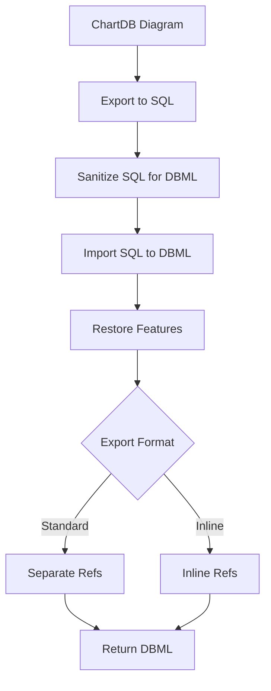

ChartDB provides comprehensive export capabilities, allowing you to generate SQL DDL scripts, DBML definitions, and visual exports for documentation and deployment.

## Export Formats

ChartDB supports multiple export formats for different use cases:

<CardGroup cols={2}>
  <Card title="SQL DDL" icon="database">
    Generate CREATE TABLE statements for any database
  </Card>
  <Card title="DBML" icon="file-code">
    Export to Database Markup Language
  </Card>
  <Card title="PNG/SVG" icon="image">
    Export diagram as image
  </Card>
  <Card title="JSON" icon="brackets-curly">
    Export raw diagram data
  </Card>
</CardGroup>

## SQL Export

### Native Dialect Export

Export SQL optimized for your diagram's database type:

```typescript
export const exportBaseSQL = ({
    diagram,
    targetDatabaseType,
    isDBMLFlow = false,
    onlyRelationships = false,
}: {
    diagram: Diagram;
    targetDatabaseType: DatabaseType;
    isDBMLFlow?: boolean;
    onlyRelationships?: boolean;
}): string => {
    // Export SQL for the target database
    switch (diagram.databaseType) {
        case DatabaseType.POSTGRESQL:
            return exportPostgreSQL({ diagram, onlyRelationships });
        case DatabaseType.MYSQL:
            return exportMySQL({ diagram, onlyRelationships });
        case DatabaseType.SQL_SERVER:
            return exportMSSQL({ diagram, onlyRelationships });
        case DatabaseType.SQLITE:
            return exportSQLite({ diagram, onlyRelationships });
    }
};
```

### PostgreSQL Export

Full PostgreSQL DDL with advanced features:

<CodeGroup>

```sql Tables
CREATE TABLE public.users (
    id SERIAL PRIMARY KEY,
    email VARCHAR(255) NOT NULL UNIQUE,
    tags TEXT[],
    settings JSONB,
    created_at TIMESTAMP DEFAULT CURRENT_TIMESTAMP
);

CREATE TABLE public.posts (
    id SERIAL PRIMARY KEY,
    user_id INT NOT NULL,
    title VARCHAR(255) NOT NULL,
    content TEXT,
    published BOOLEAN DEFAULT false,
    CONSTRAINT fk_posts_user_id 
        FOREIGN KEY (user_id) 
        REFERENCES public.users(id)
        ON DELETE CASCADE
);
```

```sql Indexes
-- B-tree indexes
CREATE INDEX idx_users_email ON public.users(email);
CREATE INDEX idx_posts_user_id ON public.posts(user_id);

-- GIN index for arrays
CREATE INDEX idx_users_tags ON public.users USING GIN(tags);

-- Partial index
CREATE INDEX idx_posts_published 
    ON public.posts(published) 
    WHERE published = true;

-- Composite index
CREATE INDEX idx_posts_user_created 
    ON public.posts(user_id, created_at);
```

```sql Custom Types
-- Enum type
CREATE TYPE order_status AS ENUM (
    'pending',
    'processing', 
    'shipped',
    'delivered'
);

CREATE TABLE orders (
    id SERIAL PRIMARY KEY,
    status order_status DEFAULT 'pending',
    created_at TIMESTAMP DEFAULT CURRENT_TIMESTAMP
);
```

```sql Check Constraints
CREATE TABLE products (
    id SERIAL PRIMARY KEY,
    price DECIMAL(10,2) NOT NULL,
    quantity INT NOT NULL,
    CONSTRAINT check_positive_price 
        CHECK (price > 0),
    CONSTRAINT check_non_negative_quantity 
        CHECK (quantity >= 0)
);
```

</CodeGroup>

### MySQL Export

MySQL-specific DDL with engine and charset:

```sql
CREATE TABLE `users` (
  `id` INT AUTO_INCREMENT PRIMARY KEY,
  `email` VARCHAR(255) NOT NULL,
  `name` VARCHAR(100),
  `status` ENUM('active', 'inactive') DEFAULT 'active',
  `created_at` TIMESTAMP DEFAULT CURRENT_TIMESTAMP,
  UNIQUE KEY `uk_users_email` (`email`),
  INDEX `idx_users_status` (`status`)
) ENGINE=InnoDB DEFAULT CHARSET=utf8mb4 COLLATE=utf8mb4_unicode_ci;

CREATE TABLE `posts` (
  `id` INT AUTO_INCREMENT PRIMARY KEY,
  `user_id` INT NOT NULL,
  `title` VARCHAR(255) NOT NULL,
  `content` TEXT,
  INDEX `idx_posts_user_id` (`user_id`),
  CONSTRAINT `fk_posts_user_id` 
    FOREIGN KEY (`user_id`) 
    REFERENCES `users` (`id`)
    ON DELETE CASCADE
) ENGINE=InnoDB DEFAULT CHARSET=utf8mb4;
```

### SQL Server Export

T-SQL with SQL Server-specific syntax:

```sql
CREATE TABLE [dbo].[Users] (
    [Id] INT IDENTITY(1,1) PRIMARY KEY,
    [Email] NVARCHAR(255) NOT NULL,
    [Name] NVARCHAR(100),
    [CreatedAt] DATETIME2 DEFAULT GETDATE(),
    CONSTRAINT [UQ_Users_Email] UNIQUE ([Email])
);

CREATE NONCLUSTERED INDEX [IX_Users_Email]
ON [dbo].[Users] ([Email]);

CREATE TABLE [dbo].[Posts] (
    [Id] INT IDENTITY(1,1) PRIMARY KEY,
    [UserId] INT NOT NULL,
    [Title] NVARCHAR(255) NOT NULL,
    [Content] NVARCHAR(MAX),
    CONSTRAINT [FK_Posts_UserId] 
        FOREIGN KEY ([UserId]) 
        REFERENCES [dbo].[Users] ([Id])
        ON DELETE CASCADE
);
```

### SQLite Export

SQLite-compatible DDL:

```sql
CREATE TABLE users (
    id INTEGER PRIMARY KEY AUTOINCREMENT,
    email TEXT NOT NULL UNIQUE,
    name TEXT,
    created_at TEXT DEFAULT CURRENT_TIMESTAMP
);

CREATE INDEX idx_users_email ON users(email);

CREATE TABLE posts (
    id INTEGER PRIMARY KEY AUTOINCREMENT,
    user_id INTEGER NOT NULL,
    title TEXT NOT NULL,
    content TEXT,
    FOREIGN KEY (user_id) REFERENCES users(id) ON DELETE CASCADE
);

CREATE INDEX idx_posts_user_id ON posts(user_id);
```

## Cross-Dialect Export

ChartDB supports deterministic cross-dialect conversions:

### PostgreSQL to MySQL

```typescript
export const exportPostgreSQLToMySQL = ({
    diagram,
    onlyRelationships = false,
}: {
    diagram: Diagram;
    onlyRelationships?: boolean;
}): string => {
    // Convert PostgreSQL types to MySQL equivalents
    // Handle unsupported features
    // Generate MySQL-compatible DDL
};
```

#### Type Mappings

| PostgreSQL | MySQL | Notes |
|------------|-------|-------|
| `SERIAL` | `INT AUTO_INCREMENT` | Auto-increment |
| `BIGSERIAL` | `BIGINT AUTO_INCREMENT` | Large auto-increment |
| `TEXT` | `TEXT` | Direct mapping |
| `BYTEA` | `BLOB` | Binary data |
| `BOOLEAN` | `TINYINT(1)` | True/False |
| `TIMESTAMP` | `DATETIME` | Date and time |
| `JSONB` | `JSON` | JSON data (MySQL 5.7+) |
| `TEXT[]` | `JSON` | Arrays converted to JSON |
| `UUID` | `CHAR(36)` | UUID as string |

<Warning>
Array types are converted to JSON in MySQL. Check constraints may need manual adjustment.
</Warning>

### PostgreSQL to SQL Server

```typescript
export const exportPostgreSQLToMSSQL = ({
    diagram,
    onlyRelationships = false,
}: {
    diagram: Diagram;
    onlyRelationships?: boolean;
}): string => {
    // Convert PostgreSQL types to SQL Server equivalents
    // Handle schema differences
    // Generate T-SQL DDL
};
```

#### Type Mappings

| PostgreSQL | SQL Server | Notes |
|------------|------------|-------|
| `SERIAL` | `INT IDENTITY(1,1)` | Auto-increment |
| `TEXT` | `NVARCHAR(MAX)` | Unicode text |
| `BYTEA` | `VARBINARY(MAX)` | Binary data |
| `BOOLEAN` | `BIT` | True/False |
| `TIMESTAMP` | `DATETIME2` | High precision |
| `JSONB` | `NVARCHAR(MAX)` | JSON as text |
| `UUID` | `UNIQUEIDENTIFIER` | Native UUID |

### Unsupported Features Detection

ChartDB detects features that don't translate well:

```typescript
interface UnsupportedFeature {
    type: 'array' | 'enum' | 'check_constraint' | 'index_type';
    tableName: string;
    fieldName?: string;
    description: string;
    suggestion: string;
}

const detectUnsupportedFeatures = (
    diagram: Diagram,
    targetDatabase: DatabaseType
): UnsupportedFeature[] => {
    const features: UnsupportedFeature[] = [];
    
    // Check for arrays (not supported in MySQL/SQL Server)
    // Check for PostgreSQL-specific index types
    // Check for enum types
    // Check for complex check constraints
    
    return features;
};
```

Warnings are included in export output:

```sql
-- WARNING: The following features are not fully supported:
-- 1. Array type 'tags' in table 'users' converted to JSON
-- 2. GIN index 'idx_users_tags' converted to regular index
-- 3. Check constraint uses PostgreSQL-specific regex
```

## DBML Export

Export to DBML format with two variants:

### Standard DBML

With standalone relationship definitions:

```dbml
Table users {
  id int [pk, increment]
  email varchar(255) [unique, not null]
  name varchar(100)
  created_at timestamp [default: `now()`]
  
  Note: 'User accounts table'
}

Table posts {
  id int [pk, increment]
  user_id int [not null]
  title varchar(255) [not null]
  content text
}

Ref: posts.user_id > users.id
```

### Inline DBML

With inline relationship references:

```dbml
Table users {
  id int [pk, increment]
  email varchar(255) [unique, not null]
  name varchar(100)
  created_at timestamp [default: `now()`]
}

Table posts {
  id int [pk, increment]
  user_id int [not null, ref: > users.id]
  title varchar(255) [not null]
  content text
}
```

### DBML Export Features

<Tabs>
  <Tab title="Table Restoration">
    Schema information is preserved:
    
    ```typescript
    const restoreTableSchemas = (dbml: string, tables: DBTable[]): string => {
        // Add schema qualifiers to tables
        // Format: Table "schema"."table_name"
    };
    ```
  </Tab>

  <Tab title="Enum Export">
    Custom types are exported as enums:
    
    ```dbml
    Enum order_status {
      pending
      processing
      shipped
      delivered
    }
    
    Table orders {
      id int [pk]
      status order_status [default: 'pending']
    }
    ```
  </Tab>

  <Tab title="Index Restoration">
    Index types are preserved:
    
    ```dbml
    Table posts {
      id int [pk]
      tags text[]
      
      Indexes {
        tags [type: gin, name: 'idx_posts_tags']
      }
    }
    ```
  </Tab>

  <Tab title="Check Constraints">
    Check constraints are included:
    
    ```dbml
    Table products {
      id int [pk]
      price decimal(10,2)
      quantity int
      
      checks {
        `price > 0` [name: 'check_positive_price']
        `quantity >= 0`
      }
    }
    ```
  </Tab>

  <Tab title="Comments">
    Table and field notes:
    
    ```dbml
    Table users {
      id int [pk]
      email varchar [note: 'User email address']
      
      Note: 'Application user accounts'
    }
    ```
  </Tab>
</Tabs>

### DBML Conversion Pipeline



The DBML export uses a round-trip process:

<Steps>
  <Step title="Generate SQL">
    Export diagram to SQL for the diagram's database type
  </Step>
  
  <Step title="Sanitize SQL">
    Clean SQL for DBML parser compatibility:
    
    ```typescript
    export const sanitizeSQLforDBML = (sql: string): string => {
        // Remove PostgreSQL-specific syntax
        // Fix constraint name duplicates
        // Handle self-referencing foreign keys
        // Normalize type casting
    };
    ```
  </Step>
  
  <Step title="Parse to DBML">
    Use @dbml/core importer to convert SQL to DBML
  </Step>
  
  <Step title="Restore Features">
    Add back features lost in conversion:
    - Table schemas
    - Index types
    - Check constraints
    - Auto-increment attributes
    - Comments and notes
  </Step>
  
  <Step title="Convert References">
    Optionally convert to inline reference format
  </Step>
</Steps>

## Export Options

### Only Relationships

Export just the foreign key constraints:

```typescript
const sql = exportBaseSQL({
    diagram,
    targetDatabaseType: DatabaseType.POSTGRESQL,
    onlyRelationships: true, // Only FK constraints
});
```

Output:

```sql
-- Foreign key constraints
ALTER TABLE posts 
ADD CONSTRAINT fk_posts_user_id 
    FOREIGN KEY (user_id) 
    REFERENCES users(id);

ALTER TABLE comments 
ADD CONSTRAINT fk_comments_post_id 
    FOREIGN KEY (post_id) 
    REFERENCES posts(id);
```

### Custom Type Handling

Control how custom types are exported:

```typescript
const supportsCustomTypes = (databaseType: DatabaseType): boolean => {
    return databaseType === DatabaseType.POSTGRESQL;
};

// For databases without custom type support,
// enums are converted to CHECK constraints
if (!supportsCustomTypes(targetDatabase)) {
    // Convert enum to VARCHAR with CHECK
    // status VARCHAR(20) CHECK (status IN ('pending', 'active'))
}
```

### Comment Support

Include table and column comments where supported:

```typescript
const databaseTypesWithCommentSupport = [
    DatabaseType.POSTGRESQL,
    DatabaseType.MYSQL,
    DatabaseType.ORACLE,
];

if (databaseTypesWithCommentSupport.includes(targetDatabase)) {
    // Add COMMENT ON statements or inline comments
}
```

## Visual Export

Export diagram as image:

<CardGroup cols={2}>
  <Card title="PNG Export" icon="image">
    Raster image for documentation
  </Card>
  <Card title="SVG Export" icon="vector-square">
    Vector image for scalability
  </Card>
</CardGroup>

### Export Quality

Control export resolution and quality:

```typescript
interface ExportImageOptions {
    format: 'png' | 'svg';
    quality?: number; // 0-100 for PNG
    backgroundColor?: string;
    padding?: number;
    includeAreas?: boolean;
    includeNotes?: boolean;
}
```

## JSON Export

Export raw diagram data for backup or migration:

```json
{
  "id": "diagram_123",
  "name": "E-commerce Database",
  "databaseType": "postgresql",
  "tables": [...],
  "relationships": [...],
  "customTypes": [...],
  "createdAt": "2024-03-04T10:30:00Z",
  "updatedAt": "2024-03-04T12:45:00Z"
}
```

This format preserves:
- All table definitions
- Field attributes and constraints
- Relationships and cardinalities
- Custom types and enums
- Table positions and colors
- Notes and areas
- Metadata and timestamps

## Export Caching

SQL exports are cached for performance:

```typescript
const generateCacheKey = (
    diagram: Diagram,
    targetDatabaseType: DatabaseType,
    options: ExportOptions
): string => {
    return `${diagram.id}_${targetDatabaseType}_${JSON.stringify(options)}`;
};

const getFromCache = (key: string): string | null => {
    const cached = cache.get(key);
    if (cached && cached.timestamp > diagram.updatedAt) {
        return cached.sql;
    }
    return null;
};
```

Cache is invalidated when diagram changes.

## Best Practices

<Tip>
For production deployments:

1. **Review generated SQL** before running on production databases
2. **Test migrations** on a staging environment first
3. **Include comments** for better documentation
4. **Export both SQL and DBML** for version control
5. **Use cross-dialect warnings** to identify compatibility issues
6. **Validate foreign keys** are in correct order
</Tip>

## Advanced Export Features

### Default Value Formatting

Default values are intelligently formatted:

```typescript
const formatDefaultValue = (value: string): string => {
    // SQL keywords (no quotes)
    if (['TRUE', 'FALSE', 'NULL', 'CURRENT_TIMESTAMP'].includes(value)) {
        return value;
    }
    
    // Function calls (no quotes)
    if (value.includes('(') && value.includes(')')) {
        return value;
    }
    
    // Numbers (no quotes)
    if (/^-?\d+(\.\d+)?$/.test(value)) {
        return value;
    }
    
    // Strings (quoted and escaped)
    return `'${value.replace(/'/g, "''")}'`;
};
```

### Identifier Quoting

Table and field names are quoted when needed:

```typescript
const getQuotedTableName = (table: DBTable): string => {
    const needsQuoting = /[^a-zA-Z0-9_]/.test(table.name);
    
    if (table.schema) {
        return needsQuoting 
            ? `"${table.schema}"."${table.name}"`
            : `${table.schema}.${table.name}`;
    }
    
    return needsQuoting ? `"${table.name}"` : table.name;
};
```

## Troubleshooting

<AccordionGroup>
  <Accordion title="Foreign Keys Fail">
    Ensure referenced tables are created before referencing tables in the export order.
  </Accordion>
  
  <Accordion title="Type Conversion Issues">
    Review cross-dialect warnings for incompatible types and adjust manually.
  </Accordion>
  
  <Accordion title="Missing Features">
    Some database-specific features may not translate. Use native export when possible.
  </Accordion>
  
  <Accordion title="Character Encoding">
    For MySQL, ensure charset and collation settings match your application needs.
  </Accordion>
</AccordionGroup>

## Next Steps

<CardGroup cols={2}>
  <Card title="AI Migration" icon="wand-magic-sparkles" href="/features/ai-migration">
    Use AI for advanced database migrations
  </Card>
  <Card title="Diagram Editor" icon="pen-ruler" href="/features/diagram-editor">
    Edit your diagram before export
  </Card>
</CardGroup>
