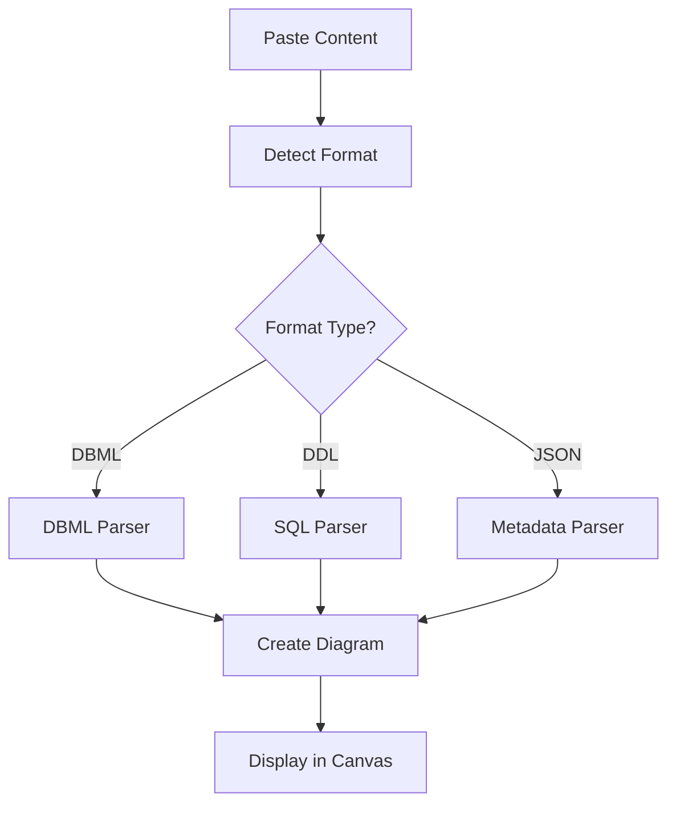

ChartDB supports three distinct import methods, each designed for different use cases and workflows. The import system automatically detects the format of your input and processes it accordingly.

## Supported Import Methods

ChartDB recognizes three import methods defined in the codebase:

```typescript
export type ImportMethod = 'query' | 'ddl' | 'dbml';
```

<CardGroup cols={3}>
  <Card title="Smart Query" icon="database" href="/features/smart-query">
    Import from database metadata JSON
  </Card>
  <Card title="DDL Import" icon="code" href="/features/ddl-import">
    Import from SQL DDL scripts
  </Card>
  <Card title="DBML Import" icon="file-code" href="/features/dbml-import">
    Import from DBML definitions
  </Card>
</CardGroup>

## Automatic Format Detection

ChartDB automatically detects which import method to use based on the content structure. The detection logic is implemented in `detectImportMethod`:

<CodeGroup>

```typescript Format Detection
export const detectImportMethod = (content: string): ImportMethod | null => {
    if (!content || content.trim().length === 0) return null;

    const upperContent = content.toUpperCase();

    // Check for DBML patterns first (case sensitive)
    const dbmlPatterns = [
        /^Table\s+\w+\s*{/m,
        /^Ref:\s*\w+/m,
        /^Enum\s+\w+\s*{/m,
        /^TableGroup\s+/m,
        /^Note\s+\w+\s*{/m,
        /\[pk\]/,
        /\[ref:\s*[<>-]/,
    ];

    const hasDBMLPatterns = dbmlPatterns.some((pattern) =>
        pattern.test(content)
    );
    if (hasDBMLPatterns) return 'dbml';

    // Common SQL DDL keywords
    const ddlKeywords = [
        'CREATE TABLE',
        'ALTER TABLE',
        'DROP TABLE',
        'CREATE INDEX',
        'CREATE VIEW',
        'CREATE PROCEDURE',
        'CREATE FUNCTION',
        'CREATE SCHEMA',
        'CREATE DATABASE',
    ];

    // Check for SQL DDL patterns
    const hasDDLKeywords = ddlKeywords.some((keyword) =>
        upperContent.includes(keyword)
    );
    if (hasDDLKeywords) return 'ddl';

    // Check if it looks like JSON
    try {
        if (
            (content.trim().startsWith('{') && content.trim().endsWith('}')) ||
            (content.trim().startsWith('[') && content.trim().endsWith(']'))
        ) {
            return 'query';
        }
    } catch (error) {
        console.error('Error detecting content type:', error);
    }

    return null;
};
```

</CodeGroup>

<Info>
The detection happens in order: DBML → DDL → JSON. This ensures that each format is correctly identified based on its unique patterns.
</Info>

## Detection Patterns

### DBML Detection

ChartDB looks for these specific patterns to identify DBML format:

<AccordionGroup>
  <Accordion title="Table Definitions">
    Pattern: `Table table_name {`
    
    ```dbml
    Table users {
      id int [pk]
      name varchar
    }
    ```
  </Accordion>

  <Accordion title="References">
    Pattern: `Ref:` or `[ref: </-/>]`
    
    ```dbml
    Ref: posts.user_id > users.id
    
    Table posts {
      user_id int [ref: > users.id]
    }
    ```
  </Accordion>

  <Accordion title="Enums">
    Pattern: `Enum enum_name {`
    
    ```dbml
    Enum order_status {
      pending
      shipped
      delivered
    }
    ```
  </Accordion>

  <Accordion title="Primary Keys">
    Pattern: `[pk]`
    
    ```dbml
    Table products {
      id int [pk]
      sku varchar [unique]
    }
    ```
  </Accordion>
</AccordionGroup>

### DDL Detection

ChartDB identifies SQL DDL by looking for these keywords:

<Tabs>
  <Tab title="Table Operations">
    - `CREATE TABLE`
    - `ALTER TABLE`
    - `DROP TABLE`
  </Tab>
  <Tab title="Index Operations">
    - `CREATE INDEX`
  </Tab>
  <Tab title="View Operations">
    - `CREATE VIEW`
  </Tab>
  <Tab title="Schema Operations">
    - `CREATE SCHEMA`
    - `CREATE DATABASE`
  </Tab>
  <Tab title="Stored Procedures">
    - `CREATE PROCEDURE`
    - `CREATE FUNCTION`
  </Tab>
</Tabs>

### JSON Detection

For database metadata queries, ChartDB looks for:

- Content starting with `{` and ending with `}`
- Content starting with `[` and ending with `]`

This is typically JSON exported from database information_schema queries.

## Import Workflow



## Supported Database Types

All import methods support multiple database types:

<CardGroup cols={2}>
  <Card title="PostgreSQL" icon="database">
    Full support including extensions, custom types, and array fields
  </Card>
  <Card title="MySQL" icon="database">
    Complete support for MySQL 5.7+ and 8.0+
  </Card>
  <Card title="SQL Server" icon="database">
    Microsoft SQL Server 2016+
  </Card>
  <Card title="SQLite" icon="database">
    SQLite 3.x with full constraint support
  </Card>
  <Card title="MariaDB" icon="database">
    MariaDB 10.2+
  </Card>
  <Card title="Oracle" icon="database">
    Oracle Database 11g+
  </Card>
  <Card title="CockroachDB" icon="database">
    CockroachDB with PostgreSQL compatibility
  </Card>
  <Card title="ClickHouse" icon="database">
    ClickHouse analytics database
  </Card>
</CardGroup>

## Import Features Comparison

| Feature | Smart Query | DDL Import | DBML Import |
|---------|------------|------------|-------------|
| Tables | ✅ | ✅ | ✅ |
| Fields | ✅ | ✅ | ✅ |
| Relationships | ✅ | ✅ | ✅ |
| Indexes | ✅ | ✅ | ✅ |
| Views | ✅ | ✅ | ❌ |
| Custom Types | ✅ | ✅ | ✅ (Enums) |
| Check Constraints | ✅ | ✅ | ✅ |
| Comments | ✅ | ✅ | ✅ (Notes) |
| Default Values | ✅ | ✅ | ✅ |
| Array Types | ✅ | ✅ | ✅ (PostgreSQL) |

## Error Handling

When import detection fails or content is invalid:

<Warning>
If the content cannot be detected as any of the three formats, ChartDB will return `null` from the detection method. Ensure your content matches one of the supported patterns.
</Warning>

<Tip>
For best results, ensure your DDL scripts are properly formatted with clear CREATE TABLE statements, and your DBML includes the required Table definitions.
</Tip>

## Next Steps

<CardGroup cols={3}>
  <Card title="Smart Query Import" icon="database" href="/features/smart-query">
    Learn about importing from database metadata
  </Card>
  <Card title="DDL Import" icon="code" href="/features/ddl-import">
    Import SQL DDL scripts
  </Card>
  <Card title="DBML Import" icon="file-code" href="/features/dbml-import">
    Work with DBML format
  </Card>
</CardGroup>
